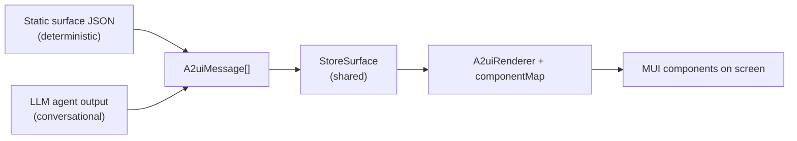
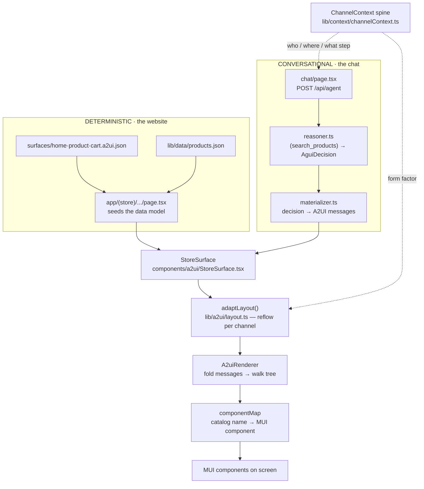
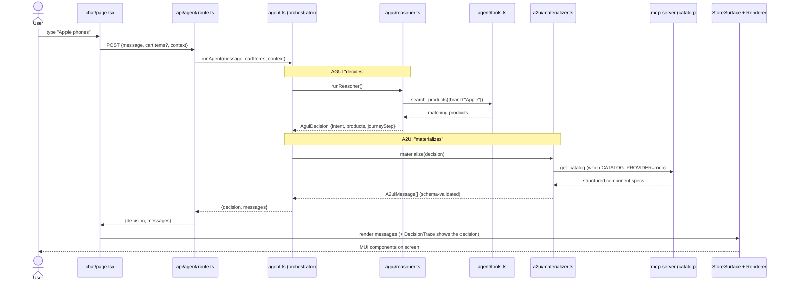
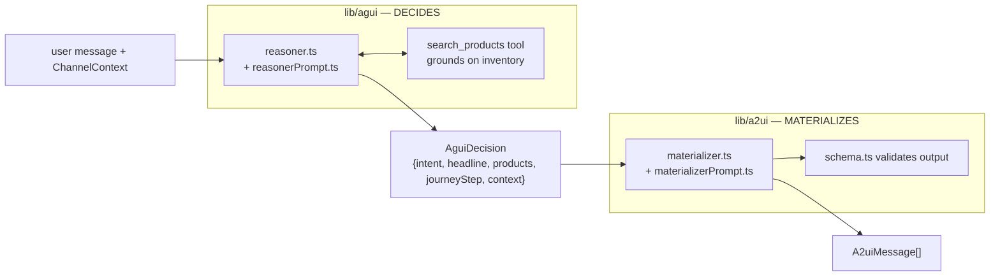
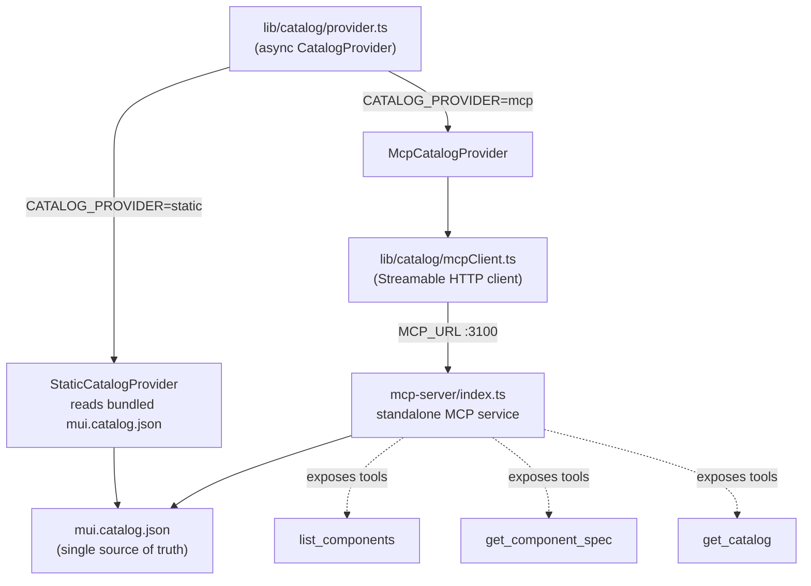
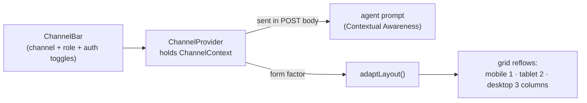

# PhoneHub — A2UI Architecture & Developer Guide

A mobile-phone e-commerce demo that teaches the **A2UI protocol**: a backend describes UI as
structured JSON (a component tree + data model + actions) that a client renders into real
components. The whole point is **two sources of UI feeding one renderer**:

- **Deterministic flow** — a normal website whose pages are hand-authored static A2UI JSON.
- **Conversational flow** — an LLM agent that generates A2UI JSON at runtime from a chat prompt.

Both render through the **same engine** using **MUI**. The MUI catalog is the single source of
truth for what components exist.

---

## Table of contents

1. [The one big idea](#1-the-one-big-idea)
2. [The two flows](#2-the-two-flows-diagram)
3. [Request lifecycle (a chat message)](#3-request-lifecycle)
4. [The AGUI ↔ A2UI split](#4-the-agui--a2ui-split)
5. [Catalog & MCP](#5-catalog--mcp)
6. [Context spine & adaptive layout](#6-context-spine--adaptive-layout)
7. [File map](#7-file-map)
8. [Where to change X](#8-where-to-change-x)
9. [How to run](#9-how-to-run)
10. [Built-in debugging tools](#10-built-in-debugging-tools)
11. [Architecture alignment phases](#11-architecture-alignment-phases)

---

## 1. The one big idea

The **only** difference between the two flows is *where the `A2uiMessage[]` comes from* — a
hand-authored file, or an LLM. From `StoreSurface` downward, both flows take a byte-for-byte
identical path. **Change the renderer once, and both flows change.**



---

## 2. The two flows (diagram)



**Reading it:** the deterministic flow seeds a data model from a static surface + `products.json`,
then renders. The conversational flow generates the surface with an LLM first, then renders through
the **same** `StoreSurface → adaptLayout → A2uiRenderer → componentMap` path. The `ChannelContext`
runs underneath both — it shapes the agent's prompt and drives layout adaptation.

---

## 3. Request lifecycle

A single chat message — *"Apple phones"* — traced through every file:



**Cart round-trip:** clicking *Add to Cart* on a chat surface is intercepted by `onEvent` in
`chat/page.tsx`, which updates the global cart and fires another `/api/agent` turn with a cart
snapshot. For that turn the reasoner is **deterministic** (no LLM call) — only the materializer runs.

**Deterministic flow** is just the last two steps: a page seeds the data model from a static surface
+ `products.json`, then the same `StoreSurface → Renderer` path runs. No agent.

---

## 4. The AGUI ↔ A2UI split

> "AGUI decides, A2UI materializes."

The agent is two layers with a typed contract (`AguiDecision`) between them. The reasoner never
emits UI; the materializer never reasons. This means a new channel can reuse the reasoner and only
swap the materializer.



- **Edit `reasonerPrompt.ts`** to change *what* the agent decides (intent classification, which
  products to surface).
- **Edit `materializerPrompt.ts`** to change *how* a decision becomes UI (composition rules,
  worked examples). The cart-total fix lived here.

---

## 5. Catalog & MCP

The MUI catalog (`mui.catalog.json`) is the contract: the agent may only emit components in it, and
the renderer maps catalog names to MUI components. It can be sourced two ways, chosen by the
`CATALOG_PROVIDER` env var.



The interface is **async** so the MCP-backed provider is a true drop-in — no caller knows the
source. `McpCatalogProvider` fetches the full catalog once per process and memoizes it.

---

## 6. Context spine & adaptive layout

`ChannelContext` ("who / where / what step") is set by the **ChannelBar**, sent to the agent on
every chat call (it shapes the prompt), and read by **adaptLayout** to reflow surfaces per channel.



`adaptLayout` is a **pure** post-process applied in `StoreSurface`. Because it's client-side,
switching channels reflows an **already-rendered** surface live — no new agent call. Single-column
lists (the cart) are deliberately preserved on every channel; only multi-column grids follow the
profile.

| form factor | product grid | cart list | container maxWidth |
|---|---|---|---|
| mobile  | 1 col | 1 (preserved) | xs |
| tablet  | 2 col | 1 (preserved) | sm |
| desktop | 3 col | 1 (preserved) | keeps authored |

---

## 7. File map

Grouped by job. **Bold paths were added during the alignment work (P0–P5).**

### Protocol engine — `lib/a2ui/` + `components/a2ui/` (rarely touched)
| File | Purpose |
|---|---|
| `lib/a2ui/types.ts` | Core types: `A2uiMessage`, `ComponentNode`, `Binding`, `SurfaceState`. |
| `lib/a2ui/resolve.ts` | Turns `{path:"/x"}` bindings into values. |
| `lib/a2ui/schema.ts` | Zod schema validating agent output before render. |
| `components/a2ui/useSurface.ts` | Pure fold: messages → `{rootId, components, dataModel}`. |
| `components/a2ui/A2uiRenderer.tsx` | Recursive tree walk from rootId. |

### Rendering & layout — `components/a2ui/` + `lib/a2ui/` (change here = both flows change)
| File | Purpose |
|---|---|
| `components/a2ui/componentMap.tsx` | **Where rendering lives.** Catalog name → MUI component. |
| `components/a2ui/StoreSurface.tsx` | **The convergence point** for both flows. Event dispatch + "Show A2UI JSON" toggle + applies adaptLayout. |
| `components/a2ui/ActionContext.tsx` | React context for `dispatch`. |
| **`lib/a2ui/layout.ts`** | `adaptLayout()` — reflows grid columns / width by channel. |

### Catalog & MCP — `lib/catalog/` + `mcp-server/`
| File | Purpose |
|---|---|
| `lib/catalog/mui.catalog.json` | **The contract.** 16 components, props, types, enums. |
| `lib/catalog/provider.ts` | Async `CatalogProvider`: Static or **Mcp**, chosen by `CATALOG_PROVIDER`. |
| **`lib/catalog/mcpClient.ts`** | MCP client — calls the catalog server over HTTP. |
| **`mcp-server/index.ts`** | Standalone MCP server (port 3100). Tools: `list_components`, `get_component_spec`, `get_catalog`. |
| `lib/catalog/validate.ts` | Catalog conformance checks (available for output repair). |

### Context spine — `lib/context/` + `components/store/`
| File | Purpose |
|---|---|
| **`lib/context/channelContext.ts`** | `ChannelContext` type, 4-channel registry, normalize + prompt helpers. Pure (server+client safe). |
| **`components/store/ChannelProvider.tsx`** | Client React context holding the active channel/journey/user. |

### Conversational agent — `lib/agui/` + `lib/agent/` + `lib/a2ui/materializer*` + `app/api/`
| File | Purpose |
|---|---|
| `lib/agent/agent.ts` | Thin orchestrator: reasoner → materializer → `{decision, messages}`. |
| **`lib/agui/reasoner.ts`** | "Decides": tool loop → `AguiDecision`. Cart path is deterministic. |
| **`lib/agui/reasonerPrompt.ts`** | Intent classification + grounding rules. **Edit to change WHAT the agent decides.** |
| **`lib/agui/types.ts`** | The AGUI↔A2UI contract — `AguiDecision`, `Product`, `CartItemData`. |
| **`lib/a2ui/materializer.ts`** | "Materializes": decision → validated A2UI (one tool-less call). |
| **`lib/a2ui/materializerPrompt.ts`** | A2UI authoring rules + catalog. **Edit to change HOW surfaces are built.** |
| `lib/agent/tools.ts` | `search_products` definition + executor over `products.json`. |
| `lib/agent/llm/*.ts` | Provider abstraction: `types`, `openai`, `anthropic`, `index` factory (reads `LLM_PROVIDER`). |
| `app/api/agent/route.ts` | POST endpoint — key check, normalize context, runAgent, return `decision`+`messages`. |

### Deterministic pages — `surfaces/` + `app/(store)/`
| File | Purpose |
|---|---|
| `surfaces/home·product·cart.a2ui.json` | Hand-authored surfaces. **Edit to change a page's layout.** |
| `app/(store)/layout.tsx` | Wraps pages in ChannelProvider + CartProvider, renders nav + **ChannelBar**. |
| `app/(store)/page.tsx` + `components/store/HomeClient.tsx` | Home grid; HomeClient intercepts `filter_brand`. |
| `app/(store)/product/[id]/page.tsx` | Seeds the data model with one product. |
| `app/(store)/cart/page.tsx` | Reads cart, computes line totals, renders cart surface. |

### Demo shell — `components/demo/` (makes the architecture visible)
| File | Purpose |
|---|---|
| **`components/demo/ChannelBar.tsx`** | Channel switcher chips + live context readout (journey / role / auth). |
| **`components/demo/DecisionTrace.tsx`** | Per chat turn, shows the `AguiDecision` behind the surface. |

### Config & data
| File | Purpose |
|---|---|
| `.env.local` | `LLM_PROVIDER`, keys, `A2UI_MODEL`, **`CATALOG_PROVIDER`**, **`MCP_URL`**. |
| `lib/data/products.json` | 10 phones. Powers both the static grid and `search_products`. |

---

## 8. Where to change X

The shortcut: decide **which of these four** the change is about — 90% of changes land here.

| I want to… | Start in | Notes |
|---|---|---|
| Change how a component **looks** | `components/a2ui/componentMap.tsx` | One place, affects both flows. |
| Change **what the agent decides** | `lib/agui/reasonerPrompt.ts` | Intent, which products to surface. |
| Change **how the agent builds a surface** | `lib/a2ui/materializerPrompt.ts` | Composition rules + examples. |
| Change a **static page** | `surfaces/*.a2ui.json` | Hand-author against the catalog. |
| Add a **new MUI component** | `mui.catalog.json` **and** `componentMap.tsx` | MCP serves the spec automatically. |
| Change **layout reflow rules** | `lib/a2ui/layout.ts` (`PROFILES`) | Single-col lists preserved in `adaptNode`. |
| Add / rename a **channel** | `lib/context/channelContext.ts` | Bar, prompt, layout all read from here. |
| Change what the agent can **search** | `lib/agent/tools.ts` + `products.json` | — |
| Add / edit **phones** | `lib/data/products.json` | Affects both flows. |
| Handle a **new event/action** | `StoreSurface.tsx` `dispatch`, or page `onEvent` | Return `true` from `onEvent` to intercept. |
| Add a **new page** | `surfaces/*.json` + `app/(store)/.../page.tsx` | Use `product/[id]/page.tsx` as a template. |
| Switch **LLM provider** | `.env.local` `LLM_PROVIDER` | Only the active provider's key is needed. |
| Switch **catalog source** | `.env.local` `CATALOG_PROVIDER` | `mcp` requires the MCP server running. |

**Debugging rule of thumb:** if a chat surface is wrong — is the *decision* wrong (→ reasoner) or is
the decision right but the *UI* wrong (→ materializer)? The DecisionTrace + "Show A2UI JSON" toggles
let you see both halves.

---

## 9. How to run

Uses **bun**. Two terminals from the `productShop` directory.

```bash
# Terminal 1 — catalog MCP server (only needed when CATALOG_PROVIDER=mcp)
bun run mcp-server     # → http://localhost:3100/mcp

# Terminal 2 — the app
bun run dev            # → http://localhost:3000
```

- Start the MCP server **before** sending a chat message when `CATALOG_PROVIDER=mcp`.
- To run without it, set `CATALOG_PROVIDER=static` in `.env.local` (one terminal).
- `.env.local` keys: `LLM_PROVIDER` (`openai`|`anthropic`) + that provider's API key, optional
  `A2UI_MODEL`, `CATALOG_PROVIDER` (`static`|`mcp`), `MCP_URL`.
- Env changes require restarting `bun run dev`.

---

## 10. Built-in debugging tools

- **"Show A2UI JSON"** toggle (on any surface) → the exact messages being rendered, *after* layout
  adaptation. The teaching view always matches the screen.
- **"AGUI decided…"** trace (each chat turn) → the `AguiDecision` the reasoner produced *before* the
  UI was built.
- **Channel switcher** (ChannelBar) → flip Mobile / Web / Associate / POS and watch the same surface
  reflow live.

---

## 11. Architecture alignment phases

This app was extended to align with a "Unified Experience Architecture / A2UI" model.

| Phase | What | Status |
|---|---|---|
| **P0** | ChannelContext spine (who/where/step), threaded UI → API → agent → prompt | ✅ done |
| **P1** | MCP Tooling — standalone catalog MCP server + `McpCatalogProvider` | ✅ done |
| **P2** | AGUI ↔ A2UI split — reasoner → `AguiDecision` → materializer | ✅ done |
| **P3** | Adaptive Layout — `adaptLayout()` reflows grids per channel | ✅ done |
| **P5** | Demo shell — ChannelBar + DecisionTrace make it visible | ✅ done |
| **P4** | Policy-governed rendering (hide/gate components by role/auth/channel) | ⏸️ intentionally skipped — too "enterprise governance" for a teaching demo. Seam: filter the tree in `StoreSurface`; role/auth toggles already exist in `ChannelBar`. |

> Channels were genericized from carrier-specific terms to `mobile` / `web` / `associate` / `pos`.
