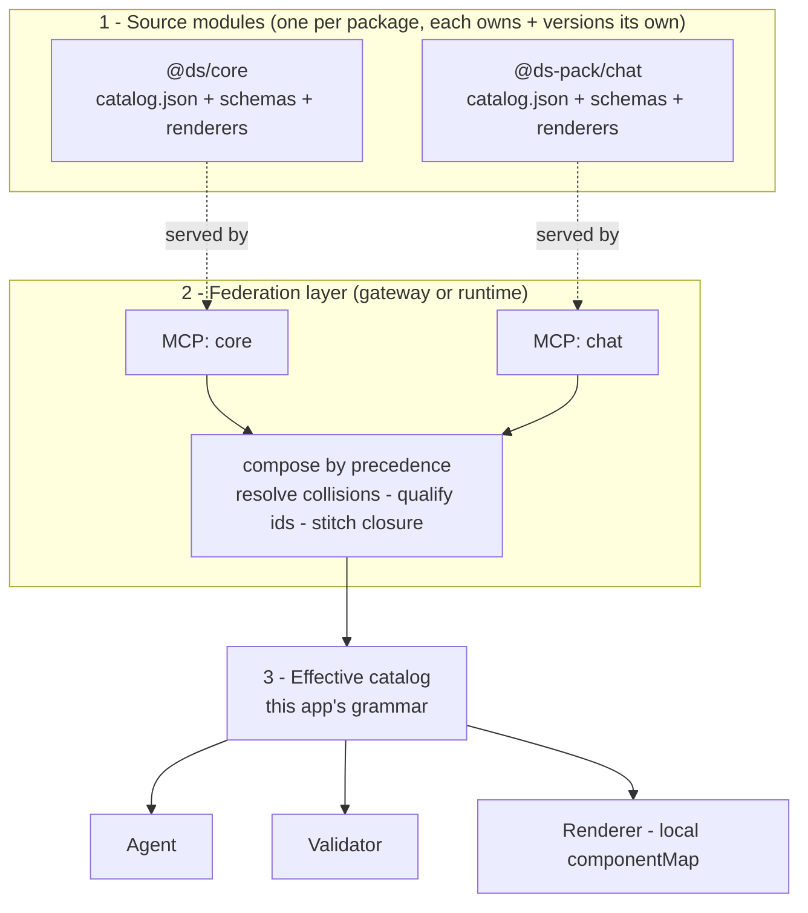
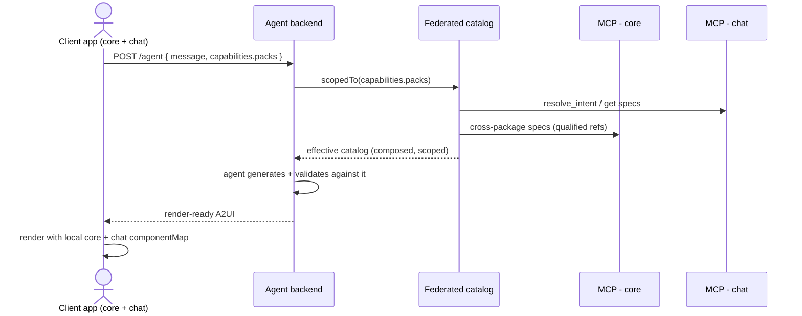

# A2UI Multi-Package Catalogs — Ecosystem Model & Adopter Guide

How a core design system **plus expansion packs** work together in A2UI: the mental model, what each
package must ship, and how an adopter wires them into one running app.

Read alongside:
- [`A2UI-DESIGN-SYSTEM-SPEC.md`](A2UI-DESIGN-SYSTEM-SPEC.md) — how a *single* package makes itself A2UI-compatible (`x-a2ui` metadata).
- Example files: [`examples/ds-core.catalog.json`](examples/ds-core.catalog.json), [`examples/ds-pack-chat.catalog.json`](examples/ds-pack-chat.catalog.json), [`examples/a2ui-composition.config.json`](examples/a2ui-composition.config.json).

---

## Table of contents
1. [How to see it — the mental model](#1-how-to-see-it--the-mental-model)
2. [Collision resolution](#2-collision-resolution)
3. [The two places config lives](#3-the-two-places-config-lives)
4. [MCP topology](#4-mcp-topology)
5. [What each package must ship (maintainers)](#5-what-each-package-must-ship-maintainers)
6. [How adopters implement it](#6-how-adopters-implement-it)
7. [Request lifecycle](#7-request-lifecycle)
8. [Reference & FAQ](#8-reference--faq)

---

## 1. How to see it — the mental model

> **Catalogs are composable modules. An app is a *composition* of modules. The protocol, agent, and
> renderer stay module-agnostic.**

This is the npm / module-federation / plugin model applied to design-system catalogs. There are three layers:



- **Source modules** — each package ships and **versions its own** catalog + zod schemas + React renderers.
  Never hand-merge these into one mega-catalog; that destroys independent ownership and versioning.
- **Federation layer** — a thin layer that talks to each package's MCP, then **composes** them into one
  effective catalog using a declared **precedence**.
- **Effective catalog** — the union the agent, validator, and renderer all consume. The protocol and engine
  don't know or care how many packages produced it.

**The payoff:** adding an expansion pack is purely additive — new components flow through discovery →
validation → rendering with **zero changes to core or the engine**.

---

## 2. Collision resolution

Two packages can define the same name (e.g. core `Button` and a chat-pack `Button` with extra props). The model:

- **Canonical ids are package-qualified:** `@ds/core:Button`, `@ds-pack/chat:Button`. Internally everything
  (renderer keys, validation lookups) uses these — zero ambiguity.
- **Unqualified names resolve by precedence:** the app declares an order, so the agent can write plain `Button`
  and get the higher-precedence one (the chat version in a chat app).
- **The shadowed one stays reachable** via its qualified id, for the rare case you need both in one surface.
- **Overrides are declared, not guessed:** the pack's `Button` carries `x-a2ui.overrides: "@ds/core:Button"`,
  turning a name clash into an *intentional* replacement.

| Concept | Where it's declared |
|---|---|
| Qualified id | derived: `package + ":" + name` |
| `overrides` | in the **pack's catalog** (`x-a2ui.overrides`) |
| precedence (who wins) | in the **app composition config** (not the catalog) |
| provenance (`x-a2ui.package`) | stamped by the **federation** onto the effective catalog |

> Think CSS specificity / npm dedup: predictable precedence + an escape hatch. Don't invent new semantics.

---

## 3. The two places config lives

This is the distinction that trips people up. Two separate concerns:

| Concern | Who sets it | When | Example |
|---|---|---|---|
| **Which packs the backend federates + precedence** | the **backend/gateway** (server config) | once, at deploy | `catalogs: [...]` in [`a2ui-composition.config.json`](examples/a2ui-composition.config.json) |
| **Which packs *this device* can render** | the **client**, per request | every `/agent` call | `capabilities.packs: [...]` in the request body |

One backend can federate core + chat, while a **web client without the chat pack** sends
`capabilities.packs: [@ds/core]` and simply never receives chat components. **One backend, many client
capability profiles.**

---

## 4. MCP topology

Each package hosts **its own MCP server** (independent ownership + deploy). The federation talks to all of them.

```
@ds/core        →  mcp.ds.com/core/mcp
@ds-pack/chat   →  mcp.ds.com/chat/mcp
```

Two placements for the federation:

| Placement | What it is | Use when |
|---|---|---|
| **Runtime federation** | a shared lib in the agent backend fans out to each MCP | a single app, simplest start |
| **Federating gateway** (recommended for a library provider) | a service you host that fronts the per-pack MCPs and presents one endpoint | many adopters — they point at one URL; you own precedence/version policy centrally |

Two rules the multi-server reality forces:
1. **Cross-package composition refs are package-qualified** — `ActionGroup.accepts: ["@ds/core:Button"]` — so
   the federation knows *which server* owns a referenced child.
2. **Cross-server closure is stitched by the federation** — resolving an `ActionGroup` from the chat MCP, it
   sees the qualified `@ds/core:Button` ref and fetches that schema from the core MCP. Pack MCPs only know
   their own components; they *reference* others by qualified id.

---

## 5. What each package must ship (maintainers)

Every package — core or pack — ships the same three things, plus a header. (Full field spec:
[`A2UI-DESIGN-SYSTEM-SPEC.md`](A2UI-DESIGN-SYSTEM-SPEC.md).)

1. **`catalog.json`** with a **package header** and `x-a2ui` metadata:
   ```jsonc
   "package": { "name": "@ds-pack/chat", "version": "1.2.0",
                "extends": { "package": "@ds/core", "range": ">=2.0.0" },
                "mcp": "https://mcp.ds.com/chat/mcp" }
   ```
2. **zod schemas** (the validation source; the catalog is generated from these).
3. **React renderers** for its components.

Expansion-pack extras:
- **Declare overrides** — `x-a2ui.overrides: "@ds/core:Button"` on a replaced component.
- **Qualify cross-package refs** — any `accepts` / `childOf` pointing at another package uses the qualified id.
- **Declare the dependency** — `package.extends` with a version range.

---

## 6. How adopters implement it

Six steps. Most are config; the only real code is the renderer composition (unavoidable — React components
can't be JSON) and it's a lookup table, not logic.

### Step 1 — Decide your pack set
Pick the packages your app uses, e.g. `@ds/core` + `@ds-pack/chat`.

### Step 2 — Write the composition config (server-side)
```jsonc
// config/a2ui-composition.config.json
{
  "catalogs": [
    { "package": "@ds/core",      "mcp": "https://mcp.ds.com/core/mcp", "precedence": 0 },
    { "package": "@ds-pack/chat", "mcp": "https://mcp.ds.com/chat/mcp", "precedence": 10 }
  ]
}
```
Higher precedence wins on a collision. Here chat overrides core for the conversational experience.

### Step 3 — Build the federated catalog (startup)
```ts
import config from './config/a2ui-composition.config.json';

// Connects to each pack's MCP, composes by precedence into ONE catalog.
const federated = createFederatedCatalog(config.catalogs);
// federated: getCatalogForPrompt(), resolveIntent(intent), getSpec(qualifiedOrName), validate(node)
```
> If you point at a **federating gateway**, this collapses to a single MCP client against the gateway URL —
> the gateway does the composition.

### Step 4 — Compose the renderer (the one bit of real code)
Import each package's React components and register them in **one** componentMap, keyed by **qualified id**.
The resolver maps unqualified names → qualified per precedence.
```ts
import * as Core from '@ds/core';
import * as Chat from '@ds-pack/chat';

export const componentMap = {
  '@ds/core:Button':       Core.Button,
  '@ds/core:Tabs':         Core.Tabs,
  '@ds-pack/chat:Button':  Chat.Button,
  '@ds-pack/chat:Greeting':Chat.Greeting,
  // …
};
```
Because the engine is **metadata-driven** (it switches on `x-a2ui.kind`), this map is the *only* per-component
work — no per-component render logic. (See the generic `renderNode` in
[`A2UI-DESIGN-SYSTEM-SPEC.md`](A2UI-DESIGN-SYSTEM-SPEC.md) §9.)

### Step 5 — Pass capabilities on every request (client)
The device declares what it can render so the agent stays inside the boundary:
```jsonc
POST /agent
{
  "message": "greet me with suggestions",
  "context": { "platform": "ios", "formFactor": "mobile" },
  "capabilities": { "packs": [ { "name": "@ds/core", "version": "2.1.0" },
                               { "name": "@ds-pack/chat", "version": "1.2.0" } ] }
}
```

### Step 6 — Scope, generate, validate (server, per request)
```ts
export async function handleAgentRequest(req) {
  const catalog  = federated.scopedTo(req.capabilities.packs); // only installed + supported packs
  const decision = await runReasoner(req.message, req.context);
  const messages = await materialize(decision, catalog);       // agent uses THIS catalog
  catalog.validate(messages);                                  // bounded to THIS catalog (repair on fail)
  return { messages };
}
```

That's it. New pack later? Add it to Step 2's config and Step 4's componentMap — nothing else changes.

---

## 7. Request lifecycle



---

## 8. Reference & FAQ

### Composition config (server)
```jsonc
{
  "catalogs": [
    { "package": "<name>", "mcp": "<url>", "precedence": <number> }
  ]
}
```

### Capabilities (client, per request)
```jsonc
{ "packs": [ { "name": "<package>", "version": "<semver>" } ] }
```

### Decision-relevant fields (who reads what)
| Field | Who | Decision |
|---|---|---|
| `package.name` / `version` | client, federation | capability negotiation, provenance |
| `package.extends` (+ range) | federation | pack→core compatibility |
| `package.mcp` | federation | which server owns this catalog |
| `x-a2ui.overrides` | federation | intentional replacement vs accidental clash |
| `x-a2ui.role` / `accepts` / `childOf` | agent, validator | composition (qualified when cross-package) |
| `x-a2ui.category` / `status` | agent | intent matching, prefer stable |
| `x-a2ui.kind` / `bindable` / `itemComponent` | renderer, validator | per-prop handling + nested validation |
| `precedence` | app config | who wins on a collision |
| `capabilities.packs` | client request | scope to what the device can render |

### FAQ

**Q: One catalog or many?**
Many — one per package, each owned/versioned by that package. Compose at runtime; never hand-merge.

**Q: Where does precedence live?**
In the **app composition config**, never in a catalog. The same pack works in any app regardless of how that
app ranks it.

**Q: Do pack MCPs need core's schemas?**
No. They *reference* core components by qualified id; the federation fetches those from core's MCP.

**Q: Does the renderer change when I add a pack?**
Only the `componentMap` (add the new names). The generic engine is metadata-driven — no render-logic changes.

**Q: What if a client doesn't have a pack?**
It omits that pack from `capabilities.packs`; the agent never emits its components. Clean degradation.
